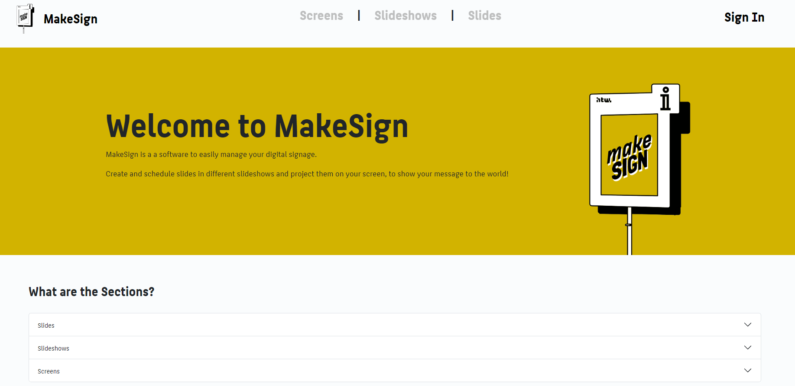
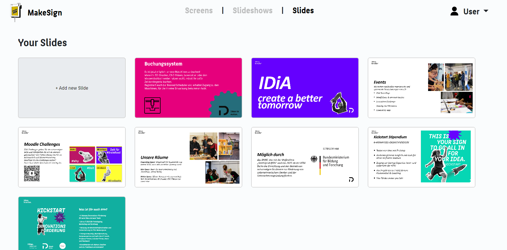
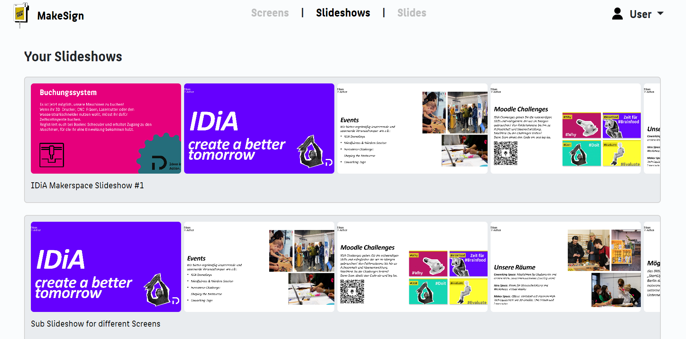
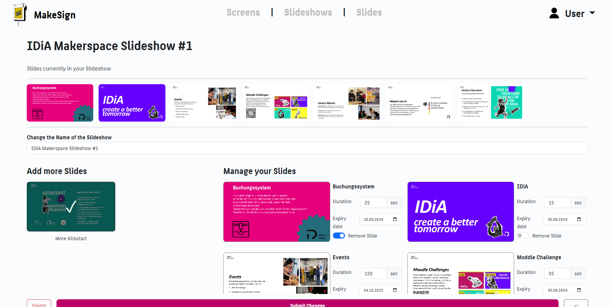
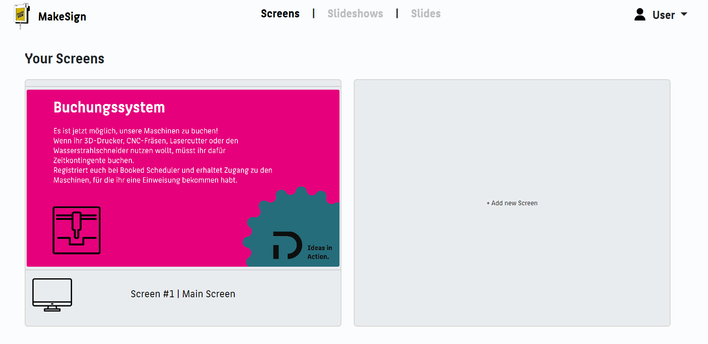
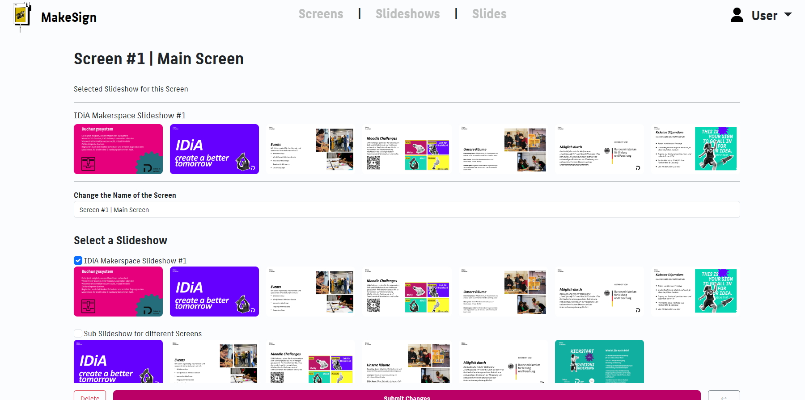

# MakeSign - My Experience

## Overview

MakeSign is a digital signage solution developed in collaboration with IDiA. It aims to provide the Makerspace with an easy way to display the availability of various tools and 3D printers via a dashboard, as well as present advertisements and announcements through a slideshow using a program.
With the help of Raspberry Pis, the dashboard and uploaded images can be displayed on monitors in the Makerspace. The MakeSign program is written in Ruby on Rails, with JavaScript for the dashboard and Bootstrap CSS for the styling.

## My Contributions

- **Research:** Explored existing digital signage solutions and hardware.
- **Raspberry Pi Setup:** Installed a custom GUI and handled kiosk mode setup.
- **Upgrading Concerto:** Attempted to resolve issues resulting from upgrading Concerto to Ruby 3.3.3. as a first attempt to our project.
- **Custom Ruby Project:** Restarted the project using a custom Ruby on Rails solution.
- **Frontend Development:** Integrated CSS, Bootstrap, and JavaScript into the Asset Pipeline.
- **Styling & Design:** Created the frontend design and styled the interface, my biggest contribution.
- **Backend:** Implementing easy sections of the backend part
- **Bug Fixes & JS Implementations:** Fixed various bugs and implemented small JavaScript features.

## Preview

The Homepage of MakeSign

The Index Page of Slides

The Index Page of Slideshows

The Edit Page of Slideshows

The Index Page of Screens

The Edit Page of Screens

# Original README

## MakeSign

MakeSign is a free and open-source digital signage solution developed by students at HTW-Berlin. It leverages old monitors in conjunction with microcomputers like Raspberry Pi to create an efficient digital signage infrastructure.

## How It Works

MakeSign is a dynamic digital signage solution designed to manage and display content efficiently across multiple screens. Here’s how it works:

- **Slides**: Upload and manage individual slides. Each slide can be customized with various media elements.
- **Slideshows**: Create and organize slideshows by adding multiple slides. Slideshows serve as collections of slides that can be displayed sequentially.
- **Screens**: Manage your screens and configure how they display content. For each monitor, you can set up a unique screen and assign a specific display link.
- **Display Management**: Within the Screens tab, select which slideshows should be displayed on each screen. You can customize the content shown on each monitor, ensuring that the right slideshows appear on the intended screens.

This setup allows for flexible and targeted digital signage solutions, making it easy to control what content is shown where and when.

## Read more in our documentation: 

[MediaSign-Website](https://makesign.github.io/)